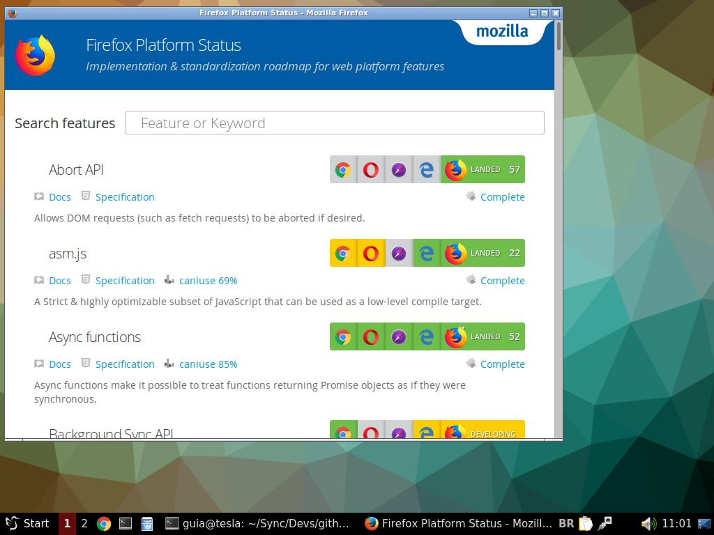

# Amofi
App mode for Firefox

[](LICENSE.md)

This script starts a new custom and uncharacteristic instance for the [Mozilla Firefox](https://www.mozilla.org/en-US/firefox/) browser. This script is not official.

## Usage

Assign execute permission to file ``amofi.sh``

``` bash
./amofi.sh https://platform-status.mozilla.org/
```

## Screenshot
[](#)

## Contributing

Please see [CONTRIBUTING](CONTRIBUTING.md) and [CODE_OF_CONDUCT](CODE_OF_CONDUCT.md) for details.

## Security

If you discover any security related issues, please email ``contato@vitortec.com`` instead of using the issue tracker.

## Credits

- [Vitor Guia](https://github.com/vitoranguia)
- [All Contributors](../../contributors)

## License

GPL-3.0-or-later. Please see [License File](LICENSE.md) for more information.
