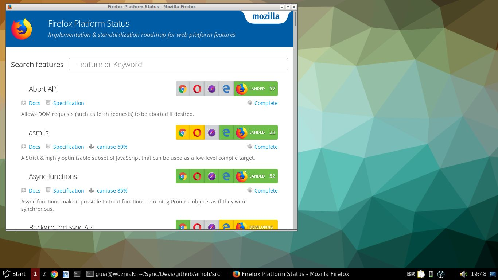

# Amofi
App MOde for FIrefox



[](LICENSE.md)

This script starts a new custom and uncharacteristic instance for the [Mozilla Firefox](https://www.mozilla.org/en-US/firefox/) browser. This script is not official.

## Install

To install you need to have the following pieces of software on your computer:

- Mozilla Firefox

The ``Mozilla Firefox`` browser is installed by default in most GNU/Linux distributions. If not installed, you can install via your operating system's package manager. For Debian-like GNU/Linux distributions this would be:

``` bash
apt-get install firefox
```

Assign execute permission to file ``src/amofi.sh``

``` bash
chmod +x ./src/amofi.sh
```

## Usage

``` bash
./src/amofi.sh https://platform-status.mozilla.org/
```

## Contributing

Please see [CONTRIBUTING](CONTRIBUTING.md) and [CODE_OF_CONDUCT](CODE_OF_CONDUCT.md) for details.

## Security

If you discover any security related issues, please email ``contato@vitortec.com`` instead of using the issue tracker.

## Credits

- [Vitor Guia](https://github.com/vitoranguia)
- [All Contributors](../../contributors)

## License

GPL-3.0-or-later. Please see [License File](LICENSE.md) for more information.
