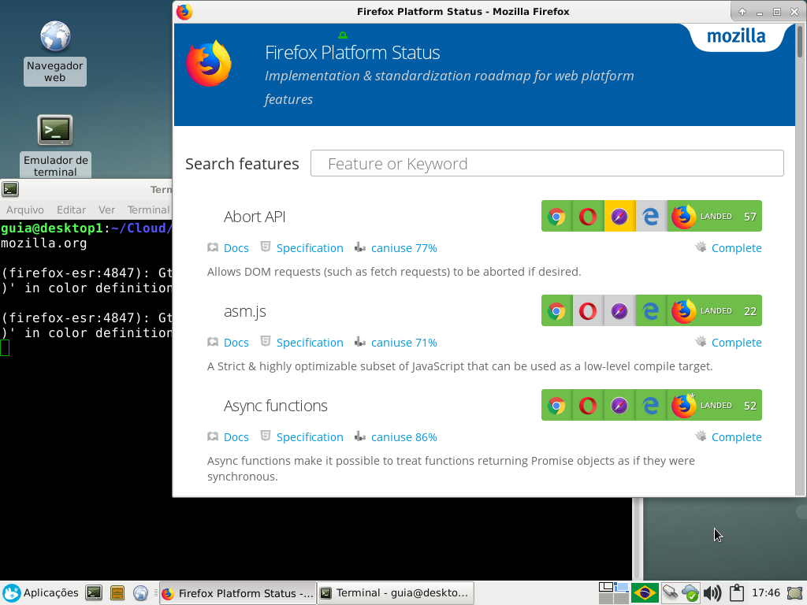

# Amofi

[](COPYING)

> App MOde for FIrefox

This script starts a new custom and uncharacteristic instance for the [Mozilla Firefox](https://www.mozilla.org/en-US/firefox/) browser. This script is not official.

This package is compatible with [ShellCheck](https://github.com/koalaman/shellcheck).

## Install

To install you need to have the following pieces of software on your computer:

- Mozilla Firefox

The `Mozilla Firefox` browser is installed by default in most GNU/Linux distributions. If not installed, you can install via your operating system's package manager. For Debian-like GNU/Linux distributions this would be:

``` bash
# apt-get install firefox
```

## Usage

Assign execute permission to file ``src/amofi.sh``

``` bash
$ chmod +x ./src/amofi.sh
$ ./src/amofi.sh https://platform-status.mozilla.org
```



## Contributing

Pull Requests not accepted, please contact us at: `contato@vitortec.com`.

### Contributors

- [Vitor Guia](https://github.com/vitoranguia)
- [All Contributors](https://github.com/vitorteccom/amofi/contributors)

## License

GPL-3.0-or-later, please see [COPYING](COPYING) file for more information.
